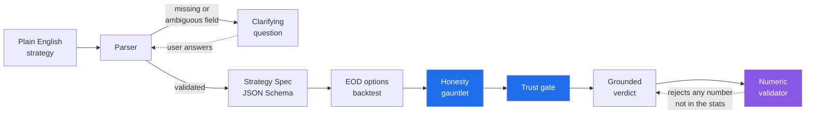
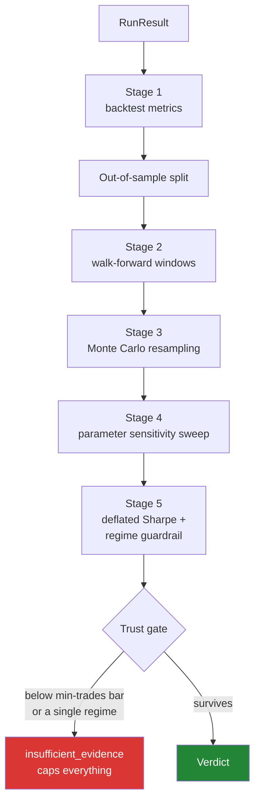
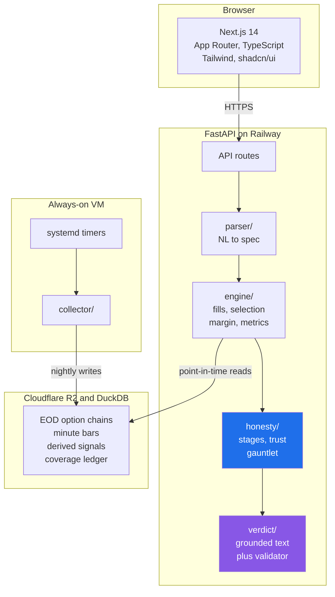
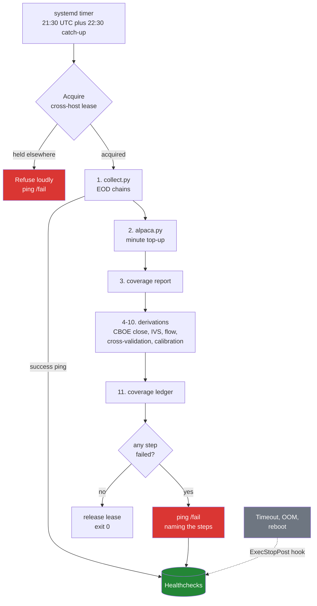
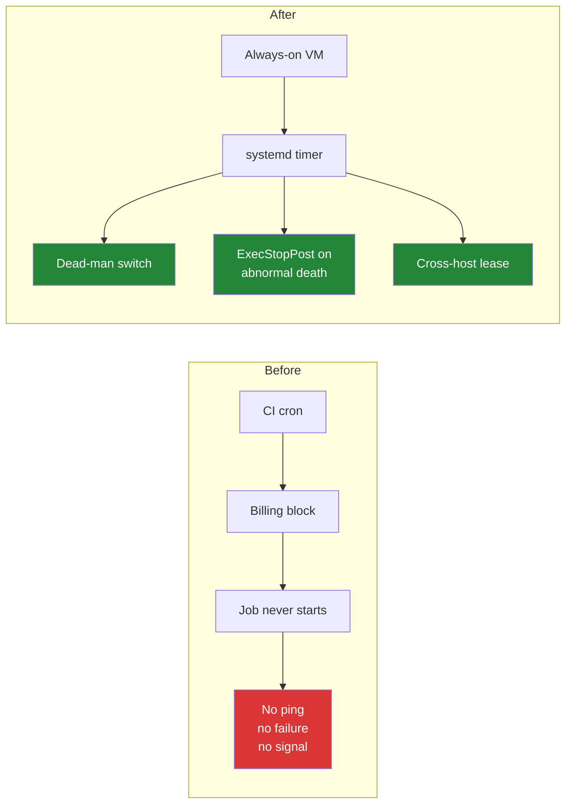

# Skeptic

**An options-research copilot that argues with you.**

You describe a strategy in plain English. It backtests it on real end-of-day
options data. Then it spends most of its effort trying to prove the result is
noise.


Single-user research tool. Not financial advice. It never emits buy or sell
recommendations.

---

## The problem I built this around

Most backtesters are optimists. They will happily show you a 3.2 Sharpe on 11
trades in one volatility regime and let you draw your own conclusion. Nothing
lies to you. It just declines to mention that the result is indistinguishable
from luck.

The backtest is the easy part. Everything downstream of it is the product.



The parser never guesses. If entry, strike, or exit is missing or ambiguous it
asks, rather than defaulting, because a silent default is a strategy you did not
describe and did not test.

---

## The honesty gauntlet

Every run is put through five stages before it is allowed to say anything.



| Stage | What it attacks |
| --- | --- |
| Out-of-sample split | Results that only exist on the data used to build them |
| Walk-forward | Strategies that worked once, in one window |
| Monte Carlo resampling | Equity curves that depend on trade ordering |
| Parameter sensitivity | Edges that vanish if a strike or DTE moves slightly |
| Deflated Sharpe | Sharpe ratios inflated by how many variations were tried |

A deliberately overfit strategy lives in the test fixtures. **If the gauntlet
ever passes it, the build fails.** That test exists so the honesty layer cannot
quietly rot into a rubber stamp.

---

## Guardrails

Enforced in code and in tests, not in a style guide.

| Guardrail | Rule | Why it exists |
| --- | --- | --- |
| **Never fill at mid** | Buys fill toward ask, sells toward bid, plus a slippage fraction of the spread. Commission always applies. | Mid fills are the easiest way to manufacture a strategy that only works in a spreadsheet. |
| **Point-in-time correctness** | A simulation at date T reads only data observed on or before T. | Lookahead is invisible in results and fatal to them. Tests exist purely to prove its absence. |
| **Grounded verdict** | Every number in the verdict text must exist in the computed stats. A validator rejects the text otherwise. | Stops the language model inventing a figure that sounds right. |
| **Prompt isolation** | The verdict model receives computed statistics only, never the raw user prompt. | It cannot be talked into a conclusion by how the question was phrased. |
| **Thin samples capped** | Below the minimum-trades bar, or inside one volatility regime, trust is capped at `insufficient_evidence`. | Good numbers on 11 trades are not good numbers. |
| **Re-grading at read time** | Saved runs re-grade when the viewer's evidence bar differs from the one they were scored at. | A verdict is a function of policy, not a frozen label. |
| **Honest coverage** | Any surface showing results also shows the data window they came from. | Results without their window are unfalsifiable. |
| **Determinism** | Same spec, same data, same seed produces identical engine and gauntlet output. | An honesty layer you cannot reproduce is not evidence. |
| **The confirmed spec is a contract** | What the confirmation screen shows is what runs. A dial changes only what that dial owns, and nothing downstream re-reads Settings to overwrite it. | The dangerous edit is the one nobody made: an unrelated dial quietly rewriting a strike rule or a fill assumption is wrong-answer-no-error. |

---

## Architecture



Frontend on Vercel. Backend on Railway. Data in R2, queried with DuckDB.
Collection on a VM that is always on, for reasons the next sections explain.

Three jobs need a language model: turning a plain-English strategy into a
validated spec, writing the verdict, and answering questions about a finished
run. All three go to DeepSeek V4 Pro through OpenRouter. It used to be two
models, a cheaper one for the writing and a stronger one for the parsing, and
collapsing that to one means there is a single behaviour to reason about
instead of a boundary to remember. The parser is the reason the stronger model
won: the cheap one invented an exit condition on a strategy that specified
none, which is precisely what guardrail 3 forbids.

None of the guardrails below depend on that choice. The verdict validator
checks numbers against computed stats no matter which model wrote the
sentence, and swapping the model is an environment variable, not a deploy.

---

## The nightly data pipeline

Eleven steps, in a fixed order, every weekday.



Three design choices in that diagram are worth explaining, because each one is
a scar.

**The chain deliberately does not use `set -e`.** A failing derivation must not
silently delete the steps behind it. Each step records its own failure and the
chain continues, exactly as the CI workflow it replaced did.

**The tile is flipped by the whole chain, not just by step 1.** `collect.py`
pings success as step 1 of 11. Without more, a chain whose derivations all
failed would leave a green dashboard. So the chain pings `/fail` itself when any
later step fails, naming the failed steps in the body, because the body is what
you read at 3am.

**A killed process cannot report on itself.** A timeout, an OOM kill, or a
reboot never reaches the script's own failure block. A systemd `ExecStopPost=`
hook fires on any non-success result and pings `/fail`. It is the only hook that
survives a SIGKILL.

---

## Why the collector moved off CI

This is the part that taught me the most, so it stays in the README.

In July a billing block refused to start the nightly job for a full trading
week. All ten scheduled runs died in under five seconds with "the job was not
started". The job never ran far enough to report a failure, so nothing alerted.
A week of missing data, discovered only by noticing that a dashboard had gone
quiet.



The lesson underneath it: **a job that fails loudly is fine, a job that fails
silently is the enemy.** Most of the operational code in this repo exists to
convert the second kind into the first. A dead-man's switch catches a job that
never runs. The `ExecStopPost` hook catches one that is killed mid-flight. The
cross-host lease stops a manual run colliding with the scheduled one on a shared
rate limit.

---

## Repository map

```
frontend/          Next.js 14 -> Vercel
backend/
  app/api/         routes: runs, jobs, data, provenance, replay, billing, admin
  app/parser/      natural language to validated spec
  app/engine/      fills, selection, margin, metrics, conditions, concurrency
  app/honesty/     stages, gauntlet, trust, ask, report
  app/verdict/     grounded text generation plus numeric validator
  app/data/        R2 and DuckDB access, coverage, point-in-time reads, signals
  tests/           1,089 tests, engine fixtures hand-computed
collector/         nightly pipeline, intraday recorder, cross-host lock
  deploy/          systemd units, bootstrap, autoupdate, health hooks
  tests/           113 tests
docs/              TECH-SPEC, DATA-PIPELINE, RUNBOOK, strategy-spec.schema.json
```

---

## Testing

**1,202 tests** (1,089 backend, 113 collector).

Every honesty-layer statistic is tested against a **hand-computed fixture**
rather than a golden file. A golden file blesses whatever the code produced on
the day someone regenerated it. A hand-computed fixture means a wrong number
stays wrong until a human works out why.

The deliberately overfit strategy fixture must always be flagged. A green run on
it is a failing build, not a passing one.

---

## Status

Working, and in daily use by me.

Not accepting contributions, and not licensed for anyone else's use. See
[LICENSE](LICENSE).

> **A note on this README.** It is kept in sync with the code by rule, not by
> good intentions. Every major change to the application updates this file in
> the same commit, enforced by a `PreToolUse` hook
> (`.claude/hooks/readme-currency.sh`) that escalates any commit touching
> application surface without a README update. If a diagram here disagrees with
> the code, that is a bug.
